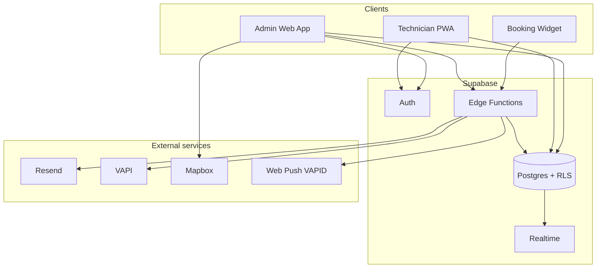

# Pool CRM / TradeFlow — Project Analysis

## Executive summary

**Pool CRM** (branded in-app as **TradeFlow CRM**) is a multi-tenant **field service management (FSM) SaaS** for trade businesses—pool cleaning, HVAC, plumbing, electrical, roofing, and similar. It provides an **office/admin web app**, a **technician mobile PWA**, a **public booking widget**, and a **Supabase** backend (Postgres + Auth + Edge Functions + RLS).

The codebase evolved from a **Lovable** starter (`vite_react_shadcn_ts`) into a production-oriented app with real Supabase integration, not mock data.

---

## Tech stack

| Layer | Technology |
|--------|------------|
| Frontend | React 18, TypeScript, Vite 5 |
| UI | shadcn/ui, Radix UI, Tailwind CSS |
| State / data | TanStack React Query, React Hook Form, Zod |
| Routing | React Router v6 |
| Backend | Supabase (Postgres, Auth, Storage, Edge Functions) |
| Maps | Mapbox GL |
| Email | Resend (via Edge Functions + templates) |
| Voice / calls | VAPI (webhooks + sync function) |
| Rich text | TipTap (email templates) |
| PWA | vite-plugin-pwa (TradeFlow branding, offline shell) |
| Tests | Vitest, Testing Library |

---

## Architecture



### Application surfaces

1. **Admin / dispatcher** (`/dashboard`, …) — roles: `owner`, `admin`, `dispatcher`
2. **Technician** (`/technician/*`) — job list, maps, checklist, completion, problems, chat FAB, push notifications
3. **Public widget** (`/widget/:embedCode`) — unauthenticated booking
4. **Auth** — login, register, forgot/reset password, onboarding (`create_business_with_owner`)

### Key directories

- `src/pages/` — route-level screens (31 page modules)
- `src/components/` — layout, modals, maps, technician UI, widget, email editor
- `src/hooks/` — 28 data hooks wrapping Supabase queries
- `src/contexts/AuthContext.tsx` — session, profile, business, onboarding
- `src/lib/email-templates/` — transactional email HTML builders
- `supabase/migrations/` — 18 SQL migrations (schema + RLS evolution)
- `supabase/functions/` — 11 Deno edge functions

---

## Data model (Postgres)

**Core entities:** `businesses`, `users` (roles), `customers`, `customer_addresses`, `appointments`, `services`, `service_categories`, `service_areas`, `invoices`, `invoice_items`.

**Scheduling:** `operating_hours`, `booking_rules`, `availability_overrides`, `technician_availability`, RPC `get_available_slots`.

**Operations:** `appointment_activity`, `appointment_photos`, `appointment_checklist_items`, `service_checklists`, `job_messages`, `job_chat_read_receipts`, `direct_messages`.

**Comms & notifications:** `email_templates`, `email_logs`, `notification_*`, `push_subscriptions`, user push preferences (migration).

**Integrations:** `call_logs`, `call_messages` (VAPI), `widget_config`, `widget_analytics`, `team_invitations`.

**Security:** Row Level Security per `business_id`; helper RPCs `get_user_business_id`, `has_role`.

---

## Edge functions

| Function | Purpose |
|----------|---------|
| `create-appointment` | Widget / API appointment creation |
| `widget-config` | Public widget settings |
| `widget-availability` | Slot availability for widget |
| `customer-portal` | Customer-facing portal token flows |
| `send-notification` | Email notifications (Resend) |
| `send-push-notification` | Web Push (VAPID) |
| `resend-webhook` | Email delivery events |
| `vapi-webhook` | Inbound voice AI events |
| `sync-vapi-calls` | Pull/sync calls from VAPI API |
| `create-team-user` | Invite / provision team members |

Most widget/webhook functions have `verify_jwt = false` in `config.toml` (public endpoints—ensure RLS and validation inside handlers).

---

## Feature map (implemented)

- Dashboard, calendar, appointments CRUD, customer CRM
- Service catalog, categories, geo **service areas** (Mapbox draw)
- Team management & invitations
- Invoices, analytics, settings
- Email templates (TipTap) + send modal + logs
- Call logs + audio player (VAPI)
- Office ↔ technician **direct messages** + **job chat**
- Technician job workflow: en route → arrived → checklist → complete / problem
- **PWA** + push notification preferences
- Embeddable **booking widget** (`public/widget-loader.js`)

---

## Auth & routing

- `AuthProvider` loads `users` + `businesses` after Supabase session
- `ProtectedRoute` enforces role + onboarding
- `TechnicianRouteGuard` isolates technician UX
- Orange (`#F97316`) design system per `tradedocs.md`

---

## Security notes (pre-publish)

1. **`.env` was previously committed** — removed from tracking; use `.env.example` locally.
2. **Anon key** is public by design but should live in env vars, not hardcoded (fixed in `client.ts`).
3. **Rotate keys** if this repo was ever public with `.env` in history.
4. Edge functions use **service role** server-side only (never in frontend).
5. Several edge functions disable JWT verification—review input validation and business scoping.

---

## Local development

```bash
npm install
cp .env.example .env   # fill Supabase values
npm run dev            # http://localhost:8080
npm run build
npm run test
```

Supabase CLI (optional): link project, `supabase db push`, deploy functions.

---

## Deployment options

- **Frontend:** Vercel, Netlify, Cloudflare Pages (static `dist/`)
- **Backend:** Supabase hosted project `rfbkwdpilwmdnaurlxhm` (or your own)
- Set env vars: `VITE_SUPABASE_*` on host; secrets on Supabase for Edge Functions

---

## Recommendations

1. Add CI (lint, test, build) on GitHub Actions.
2. Add `user_push_preferences` / secrets documentation for VAPID + Resend + VAPI.
3. Split `tradedocs.md` (2586 lines spec) from runtime README.
4. Increase test coverage beyond `src/test/setup.ts`.
5. Consider renaming package from `vite_react_shadcn_ts` to `pool-crm`.

---

## Repository metadata

- **Prior remote:** `adrianoreff/tradeflow-hub-87` (Lovable export name)
- **Suggested GitHub name:** `pool-crm` (matches workspace folder)
